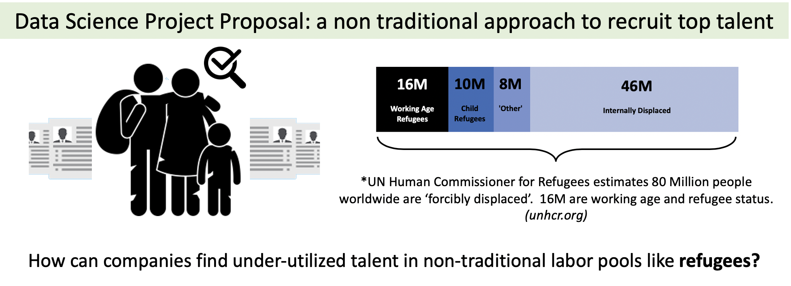
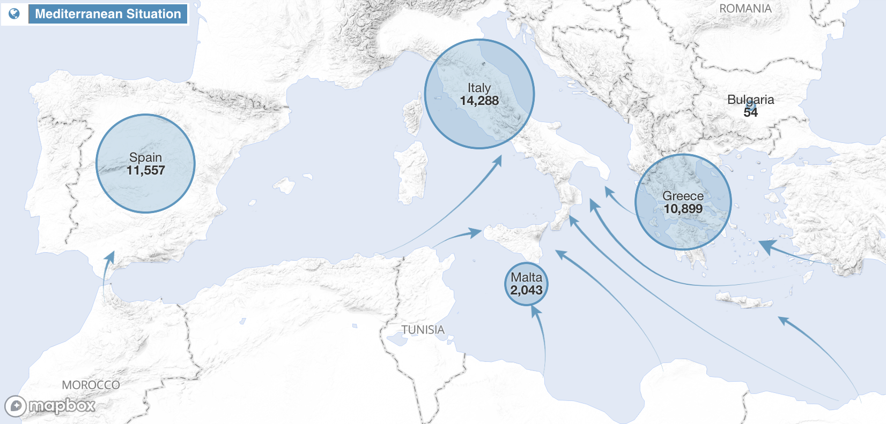

# Project_proposal_2020

# A data based approach to hire diverse refugee talent and drive business value.  
Author: Daniel Macdonald @talentrics http://www.talentrics.com/

Talent Management trends require a strategic approach to build a diverse workforce, and adopt macro-econnomic trends such as: globalization, technology, remote work, and flexible work. (Dikau & Hatfield 2020)

# What needs to be done about it?

An alternative to the traditional approach is to tap into non-traditional markets for talent - to actively seek out people with the required skills and capabilities who may have a high incentive to say yes.  Organizations like 'Talent Beyond Boundaries' (https://www.talentbeyondboundaries.org/) or 'Refugee Talent' (https://refugeetalent.com/) are startups that represent the growing trend in refugee placement, and the potential to be using best practices in job matching and artificial intelligence to drive career mobility that reverses the trend in the refugee experience.  This project looks at how we might use a data driven approach to sourcing talent from un-tapped markets.

# How would it work?

The core idea is to match potential job seekers with open requisitions by overlapping a few data sources and applying Machine Learning best practices.  The matching process would source data for refugees and job providers to help find job opportunities, match candidates.  It will require techniques that employe big data 'harvesting' from online sources, apply natural language processing methods such as skills ontology, and provide employers with a short list of candidates.

# data sources and initial EDA

 - The Open Skills Project http://dataatwork.org/data/
 The Open Skills Project is a public-private partnership lead by the University of Chicago focused on providing a dynamic, up-to-date, locally-relevant, and normalized taxonomy of skills and jobs that builds on and expands on the Department of Labor’s ONet Data Resources.  Link to initial investigation of the data source can be found here: https://github.com/talentrics/Project_proposal_2020/blob/master/Open_Skills_Jobs_API.ipynb
 
 - Job Data https://blog.thedataincubator.com/tag/data-sources/
 As part of the 'Data Incubator' data sources, I downloaded an example file of the Job Postings data set for all NYSE and Nasdaq stocks.
 The file is one of seven that are available, and is 25GB, so manipulating this data will require big data management skills.  I have posted my initial investigation of the source here: 
 https://github.com/talentrics/Project_proposal_2020/blob/master/datalab_jobs.ipynb
 
 - refugees with skills
 - UNHR

# Citations: 

Dikau, D., & Hatfield, S. Deloitte Publishing (2020); "Creating Value and Impact through the Alternative Workforce"
https://www2.deloitte.com/us/en/pages/human-capital/articles/alternative-workforce.html
