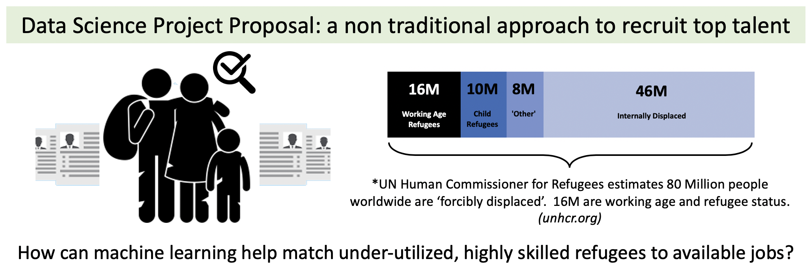
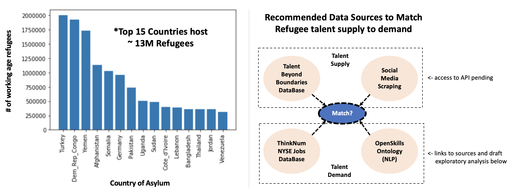

# A data based approach to hire diverse refugee talent  
Author: Daniel Macdonald @talentrics http://www.talentrics.com/

A recent Deloitte whitepaper presents research into how companies are 'Creating Value and Impact Through the Alternative Workforce', pointing to market shifts such as rapidly developing technology, market globalization and the need for agile workforce strategies as a unique opportunity for businesses to leverage global market changes (Dikau & Hatfield 2020).  In parallel, the growing field of 'People Analytics' suggests that corporations can apply data science to their talent strategy, using data science to improve on people processes.

This proposal looks at how such organizations may use a data driven approach to drive a growing interest in 'Diversity and Inclusion' programs.  Machine learning could be used to help match people who have been forcibly displaced from their homes with current opportunities for employement.  Such an approach has the potential to address business needs to hire highly skilled professionals while also filling a growing social need. (Cousins & Laurie 2019)

# How would it work?

The recommended approach is to use machine learning and skills ontologies to match refugee talent to current job listings.

The data sources - on the talent supply side, data may come from specially curated databases such as the 'Talent Beyond Boundaries' talent catalog, or via available social media feeds.  Talent demand would be referenced via the Thinknum NYSE Jobs Database, and the matching engine would use a NLP approach such as the 'OpenSkills Project' from Data at work. (links to sources in citations below)

Statistics on refugee populations from https://www.unhcr.org

# Exploratory Data Analysis & Proof of Concept:

# Citations: 

Dikau, D., & Hatfield, S. Deloitte Publishing (2020); "Creating Value and Impact through the Alternative Workforce"
https://www2.deloitte.com/us/en/pages/human-capital/articles/alternative-workforce.html

Cousins,S., Lawrie, R. & Nyce, S. Talent Without Boundaries (2019); "The Promise of Labour Mobility"
https://static1.squarespace.com/static/5dc0262432cd095744bf1bf2/t/5ed20b4cdef8546a019d216b/1590823775767/TBBGRFReport2019.pdf

UNHCR, “Figures at a Glance”, https://www.unhcr.org/en-au/figures-at-a-glance.html

Talent Beyond Boundaries Talent Catalog
https://www.talentbeyondboundaries.org/the-talent-catalog

OpenSkills Project
http://dataatwork.org/data/
